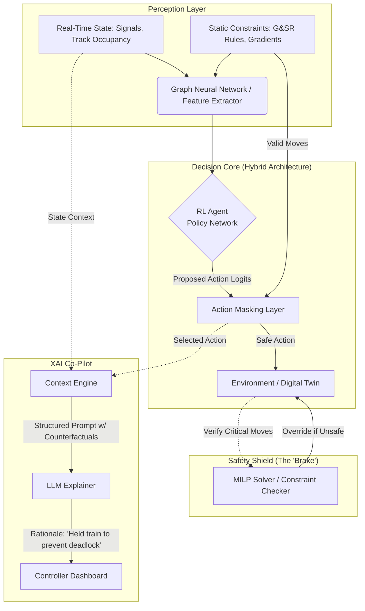

# Roboflow AI Simulation

This project is designed to simulate and test the effectiveness of Roboflow AI metrics. The goal is to perform comprehensive testing, compare results with the current situation, and analyze performance across various scenarios.

## Project Structure

The project is organized as follows:

- **src/**: General source code utilities.
- **simulation/**: The core "Digital Twin" environment and RL agents.
- **knowledge_base/**: Static database for G&SR rules, network topology, and train specs.
- **constraints/**: MILP/OR logic for enforcing safety and validity constraints.
- **models/**: Directory for storing trained RL model checkpoints.
- **config/**: Configuration files for simulation parameters and environment settings.
- **data/**: Directory for storing datasets.
  - `raw/`: Original, immutable data.
  - `processed/`: Data that has been cleaned and transformed for the simulation.
- **notebooks/**: Jupyter notebooks for exploratory data analysis (EDA), prototyping, and visualization of results.
- **tests/**: Unit and integration tests to ensure the reliability of the simulation code.
- **results/**: Output directory for simulation logs, generated metrics, and comparison reports.

## 5. ML Strategy & Tech Stack
For a detailed breakdown of why we use **Reinforcement Learning (PPO)** instead of LLMs (LangChain), and how we handle **G&SR Rules**, please see [ML_STRATEGY.md](ML_STRATEGY.md).

## Getting Started

### Prerequisites

- Python 3.11+
- [List other dependencies here, e.g., NumPy, Pandas, SimPy]

### Local Setup Guide

1. **Clone the repository:**
   ```bash
   git clone https://github.com/zer-art/Roboflow
   cd Roboflow
   ```

2. **Create and Activate Conda Environment:**
   Ensure you have [Anaconda](https://www.anaconda.com/) or [Miniconda](https://docs.conda.io/en/latest/miniconda.html) installed.
   ```bash
   conda create -n roboflow python=3.11 -y
   conda activate roboflow
   ```

3. **Install Dependencies:**
   ```bash
   pip install -r requirements.txt
   ```

## Usage

1. **Configuration**: Modify the configuration files in `config/` to set up your simulation parameters.
2. **Run Simulation**: Execute the main simulation script (to be implemented in `src/`).
3. **Analyze Results**: Check the `results/` folder for logs and metric reports. Use the notebooks in `notebooks/` for detailed analysis.

## 6. Detailed Testing Scenarios
We will rigorously test the system against three core scenarios to demonstrate Efficiency, Safety, and Resilience.

### Scenario A: The "Overtake" (Efficiency)
*   **Situation**: A slow *Goods train* is ahead of a fast *Vande Bharat* express.
*   **Human Logic (Baseline)**: Often keeps the Goods train moving until a major junction, causing the Vande Bharat to trail behind and accumulate delay.
*   **RailFlow AI**: Identifies a small loop line 10km ahead, calculates that the Goods train length fits, and executes a "dynamic overtake" (sidelining the Goods train just in time).
*   **Target Metric**: "Vande Bharat Delay Reduced by 15 mins."

### Scenario B: The "Deadlock Prevention" (Safety/OR)
*   **Situation**: Two trains are approaching a single-line section from opposite directions.
*   **Human Logic**: Might accidentally let both enter up to the last signal, causing a standoff where one has to reverse (massive delay).
*   **RailFlow AI**: The MILP (Operations Research) layer detects this conflict 30 minutes in advance and holds one train at the previous station.
*   **Visual Outcome**: "Safety Shield" triggers an override, preventing the deadlock.

### Scenario C: The "Cascading Delay" (Resilience)
*   **Situation**: A signal fails at a major station for 20 minutes.
*   **Human Logic**: Manually re-plans, often causing ripples that last 6 hours across the network.
*   **RailFlow AI**: Re-optimizes the entire schedule in seconds, shuffling 10 other trains to different tracks to absorb the shock.
*   **Target Metric**: "Network Recovery Time: 2 hours (AI) vs 6 hours (Historical)."

## Reference Documents

- `RailFlow-AI-2.pdf`: Reference document for AI capabilities and metrics (located in root).

## Contributing

Please read the contributing guidelines before submitting pull requests.

## License

[License Name]
# RailFlow AI Architecture & Implementation Strategy

## 1. Architecture Evaluation
**Verdict:** The proposed architecture (Hybrid Intelligence: MILP + RL) is **excellent** and represents the state-of-the-art for railway scheduling and dispatching systems.

*   **Why it works:**
    *   **Reinforcement Learning (RL):** Excellent for pattern recognition and speed. It learns "heuristics" from historical data to make fast decisions (e.g., "fast passenger train usually passes freight here").
    *   **Operations Research (MILP):** Essential for **safety and hard constraints**. RL can sometimes hallucinate or suggest unsafe moves. The MILP layer acts as a "safety shield" ensuring no G&SR rules are violated.
    *   **Constraint Modeling:** Absolutely critical. The exact track layout, signal distances, and gradient rules must be modeled physically.

## 2. Refined Workflow
The user proposed: *Data -> Fine-tuning -> Rules Database*.
**Recommended Refined Workflow:**

1.  **Data Ingestion (Historical)**: Load 3-6 months of "Control Charts" (train movements). Clean anomalies.
2.  **Digital Twin Construction (The Simulation)**:
    *   This is the most critical step. You must build a simulation strictly based on the **G&SR (General & Subsidiary Rules)** database.
    *   The "Static Database" isn't just looked up; it **defines the physics** of the world.
3.  **Offline RL Training (Imitation Learning)**:
    *   Instead of starting from zero, train the RL agent to *imitate* what the best Section Controllers did in the historical data. This is faster than "fine-tuning".
4.  **Online RL Training (Improvement)**:
    *   Let the agent play in the Digital Twin to find *better* moves than the humans did, optimized for Punctuality and Energy.
5.  **Safety Shield (Deployment)**:
    *   Output of RL -> MILP Solver -> Final Command.

## 3. Model Training Parameters
For a typical Railway RL environment (e.g., using PPO or DQN):

| Parameter | Recommended Value | Purpose |
| :--- | :--- | :--- |
| **Algorithm** | PPO (Proximal Policy Optimization) | Stable, handles continuous/discrete action spaces well. |
| **Learning Rate** | `3e-4` (starts high, decays) | Step size for updates. |
| **Gamma (Discount)** | `0.99` | Prioritizes long-term rewards (avoiding delays hours later). |
| **Batch Size** | `64` to `256` | Number of experiences to learn from at once. |
| **Replay Buffer** | `100,000` steps | (For DQN/SAC) Stores history to learn from. |
| **Reward Function** | `+1` per train arrival, `-0.1` per min delay | **Crucial**: Needs careful tuning. |

## 4. Project Structure Updates
- **simulation/**: Source code for the "Digital Twin", RL agents, and constraint validators.
- **config/**: Configuration files for parameters and settings.
- **data/**:
  - `rules/`: Static G&SR rules and network topology.
  - `models/`: Trained RL model checkpoints.
  - `raw/` & `processed/`: Simulation datasets.
- **notebooks/**: Experiments and analysis.
- **tests/**: Unit and integration tests.
- results/**: Logs and metric outputs.

## 5. Explainable AI (XAI) Architecture
**Goal:** Use Fine-Tuned LLMs to provide human-readable explanations for the *decisions made by the RL Core*, without involving them in the critical control loop.

### 5.1 The "Two-Brain" System
We separate **Control** (High Precision, Low Latency) from **Explanation** (High Context, Natural Language).



### 5.2 Layer Implementation
#### Layer 1: The Core (The Brain)
*   **Role**: Makes the actual decision.
*   **Tech**: Stable-Baselines3 (PPO) + Google OR-Tools.
*   **Output**: Numerical Action (e.g., `Action_ID: 4` -> "Switch Train 105 to Loop Line").
*   **Latency**: < 50ms.

#### Layer 2: The Context Engine (The Translator)
*   **Role**: Converts the "black box" numerical state into a linguistic context.
*   **Process**:
    *   Takes `Action_ID: 4`.
    *   Queries `Knowledge_Base`: "What implies Action 4?" -> "Loop Line entry".
    *   Queries `State`: "Why?" -> "Train 105 is slower than Train 202 approaching behind".
*   **Output JSON**:
    ```json
    {
      "action": "Switch to Loop Line",
      "subject": "Train 105 (Goods)",
      "conflicts": ["Train 202 (Vande Bharat) approaching on Main Line"],
      "rule_ref": "G&SR Rule 3.4(b) - Priority Overtaking"
    }
    ```

#### Layer 3: The Explainer (The Voice)
*   **Role**: Generates the final user-facing text.
*   **Tech**: **Fine-Tuned Llama-2-7B** or **Mistral-7B**.
*   **Input**: The JSON from Layer 2.
*   **Prompt**:
    > "You are a Senior Section Controller. Explain why Train 105 was moved to the Loop Line based on the provided context."
*   **Output**:
    > "I moved the Goods Train (105) to the loop line to allow the higher-priority Vande Bharat (202) to pass. Keeping 105 on the main line would have caused a 4-minute delay to 202."

### 5.3 Fine-Tuning Strategy
We do not use a "General Intelligence" model; we create a **Task-Specific Specialist**.

*   **Model**: Llama-2-7b-chat (Quantized to 4-bit for speed).
*   **Dataset Source**:
    1.  **Rule Logs**: Manually crafted pairs of (Situation -> Rule citations).
    2.  **Controller Commentaries**: Recorded reasons from human controllers (e.g., "Stopped here because signal was red").
    3.  **RL Value Function**: Validating *why* a state has high value (e.g., "High reward expected because conflict avoided").
*   **Training Method**: QLoRA (scarcity of compute).
*   **Objective**: Maximize factual consistency with the JSON input (reduce hallucinations).
